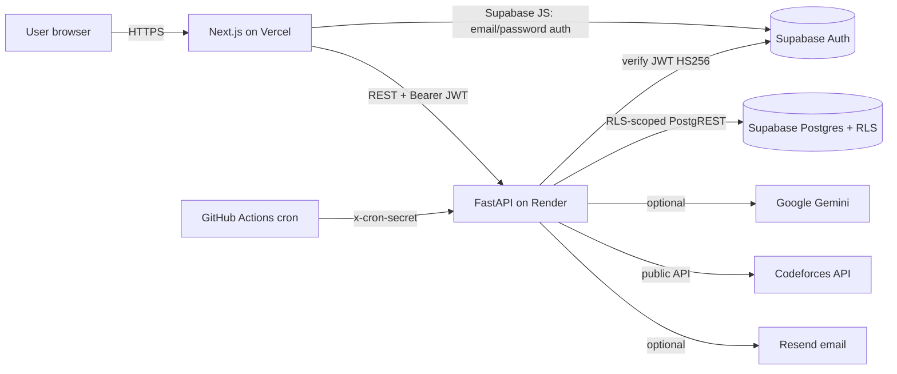
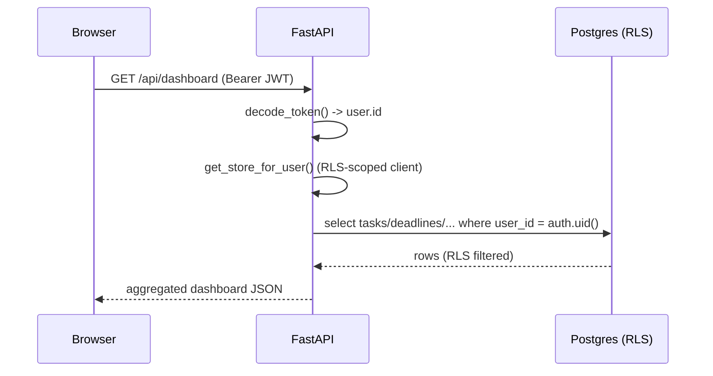
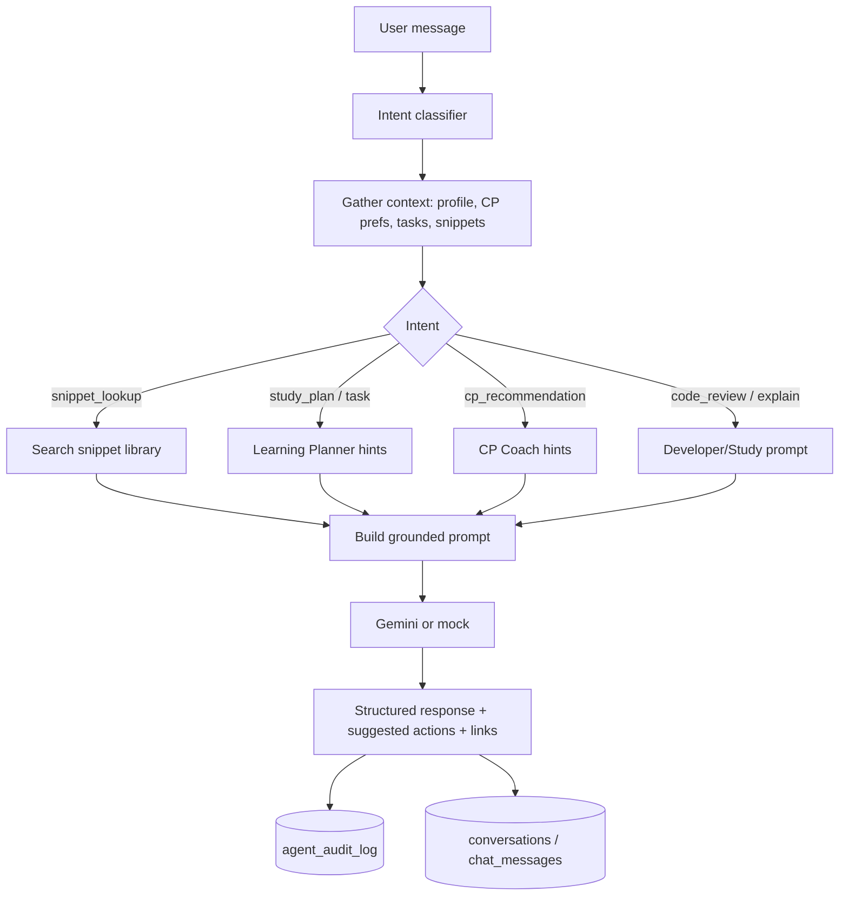

# Architecture

## System overview



- The browser authenticates directly with **Supabase Auth** and sends the
  resulting JWT to FastAPI.
- FastAPI **verifies** the JWT (HS256, `SUPABASE_JWT_SECRET`), then builds a
  Supabase client **carrying that token**, so Postgres **Row Level Security**
  enforces per-user access on every query.
- The **service-role** key is used *only* by cron jobs and never reaches the
  browser.
- With no secrets, the API runs in **demo mode** against an in-memory store and
  mock AI.

## Request lifecycle



## Agentic workflow (chat)

The orchestrator is a **controlled, observable** flow — not autonomous agents.



**Human-in-the-loop:** suggested actions (generate plan, create task, get CP
problems) are *proposed*, never auto-executed. Deleting data, sending email, or
changing major preferences always requires an explicit user action.

### Modules
| Module | Code | Responsibility |
|---|---|---|
| Orchestrator | `agent/orchestrator.py` | route, ground, respond, audit |
| Intent router | `agent/intent_router.py` | deterministic keyword classification |
| Learning Planner | `services/planner_service.py` | plans, priority, recovery |
| CP Coach | `services/cp_service.py`, `codeforces_client.py` | profile, picks |
| Developer Assistant | `services/gemini_service.py`, snippets routes | review, snippets |
| Notification Scheduler | `services/notification_service.py` | create/deliver |
| Analytics & Reflection | `services/analytics_service.py` | summaries, weak topics |

## Notification & cron workflow

```mermaid
flowchart LR
  subgraph GitHub Actions (free)
    C1[daily-planning\nevery 6h]
    C2[send-notifications\nevery 15m]
    C3[weekly-summary\nSun ~18:00 UTC]
  end
  C1 -->|x-cron-secret| EP1[/internal/cron/daily-planning/]
  C2 -->|x-cron-secret| EP2[/internal/cron/send-notifications/]
  C3 -->|x-cron-secret| EP3[/internal/cron/weekly-summary/]
  EP1 --> J[Idempotent per-user processing]
  EP2 --> J
  EP3 --> J
  J --> DB[(Supabase, service role)]
```

- All cron endpoints are **idempotent** and compute "today"/"this week" **per
  user timezone**, so repeated/approximate runs are safe.
- Delivery respects **quiet hours** and a **daily cap**; in-app always works,
  email/push only when configured.

## Data model
14 tables in `supabase/migrations/0001`: `profiles, courses, deadlines, tasks,
study_sessions, cp_preferences, cp_recommendations, snippets, quiz_attempts,
notifications, weekly_summaries, conversations, chat_messages, agent_audit_log`.
RLS in `0002`, snippet full-text search in `0003`, notification settings in `0004`.

## Security model
- Supabase Auth + JWT verification in FastAPI.
- RLS: users touch only their own rows; built-in public snippets are read-only
  to all; audit log is append + read-own.
- Service role confined to server-side cron.
- Rate limits on `/api/chat` and `/api/cp/*`; Pydantic validates all input;
  consistent error envelope; logs never contain secrets.
